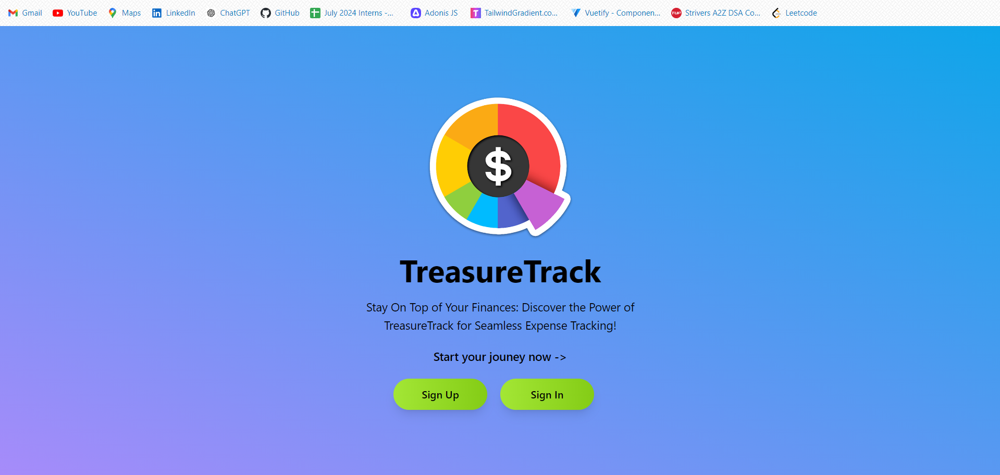
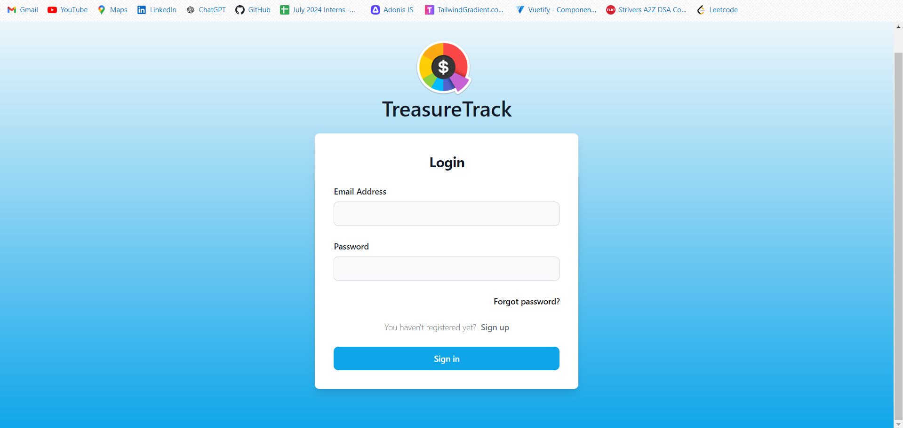
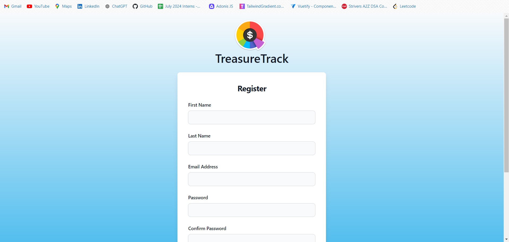
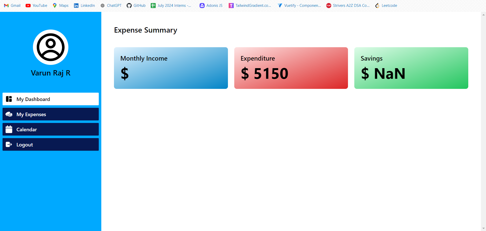
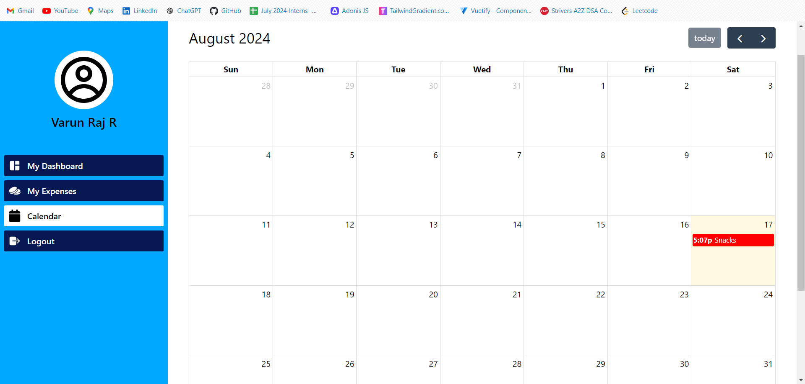
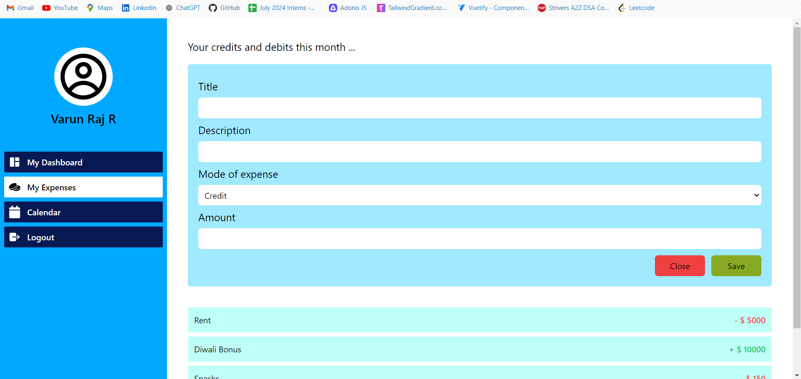

# Personal Finance Tracker

## Overview

The Personal Finance Tracker is a simple and intuitive application designed to help users manage their financial transactions. Built using the MERN stack (MongoDB, Express, React, Node.js), this project was developed as part of a task for a MERN stack internship application in a day. The application focuses on providing users with a straightforward interface to track income, expenses, and savings. It includes a dashboard for quick insights, a calendar to visualize expenses, and forms for creating and managing financial records.

[Gratitude Grove - Backend](https://github.com/Varunkumar0812/Finance-Tracker-backend)

## Features

- **Landing Page:**  
  A welcoming page with links to the Login and Register pages.
  
- **Login Page:**  
  Allows users to authenticate using a login form. The form was built using Tailwind CSS templates, and authentication requests are handled via Axios.
  
- **Register Page:**  
  Provides a registration form for new users, also built using Tailwind CSS templates.
  
- **Dashboard:**  
  Displays an overview of the user's financial statistics, including total income, total expenditure, and total savings.
  
- **Calendar Page:**  
  Uses the React Full Calendar library to render a calendar view of daily expenses, allowing users to visualize their spending habits over time.
  
- **My Expenses Page:**  
  Lists all expenses as cards. Users can add new expenses via a form that is accessed by a button in the top navbar.

## Tech Stack

- **Frontend:**
  - **React.js:** JavaScript library for building the user interface.
  - **Tailwind CSS:** Utility-first CSS framework for styling.
  - **React Router:** For page navigation and routing.
  - **Axios:** For making HTTP requests to the backend.
  - **React Full Calendar:** For rendering a calendar view in the Calendar page.

- **Backend:**
  - **Node.js:** JavaScript runtime for running the server.
  - **Express.js:** Web framework for Node.js to handle routing and requests.
  - **MongoDB:** NoSQL database to store user data and financial transactions.
  - **Mongoose:** ODM library for MongoDB to interact with the database.

## Screenshots

Here are some screenshots of the Personal Finance Tracker application:

### Landing Page
  
*Description:* A simple page with a welcoming message and links/buttons to login and register.

### Login Page
  
*Description:* A login form centered on the page, styled using Tailwind CSS, with fields for email and password, and a submit button.

### Register Page
  
*Description:* A registration form similar to the login page, with fields for name, email, password, and confirm password.

### Dashboard Page
  
*Description:* A page showing overall financial statistics: total income, total expenditure, total savings, displayed in cards or a chart.

### Calendar Page
  
*Description:* A calendar displaying expenses on each day, using the React Full Calendar library.

### My Expenses Page
  
*Description:* A list of expense cards, each showing details like date, amount, and category. A navbar at the top with a Create New Expense option ( "+" button).

## Contributing

This project was developed as a basic implementation and is open for contributions. Feel free to fork the repository, make your changes, and submit a pull request.

1. Fork the repository.
2. Create a new branch (`git checkout -b feature-branch`).
3. Make your changes.
4. Commit your changes (`git commit -m 'Add new feature'`).
5. Push to the branch (`git push origin feature-branch`).
6. Open a pull request.

## License

This project is licensed under the MIT License. You are free to use, modify, and distribute this software as per the terms of the license.

## Acknowledgements

- **React.js** for providing the framework to build the frontend.
- **Tailwind CSS** for the easy and flexible styling solutions.
- **React Full Calendar** for the calendar component.
- **MongoDB** and **Mongoose** for the database management.
- **Express.js** for the backend framework.
